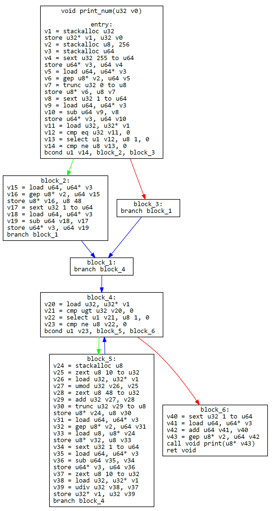
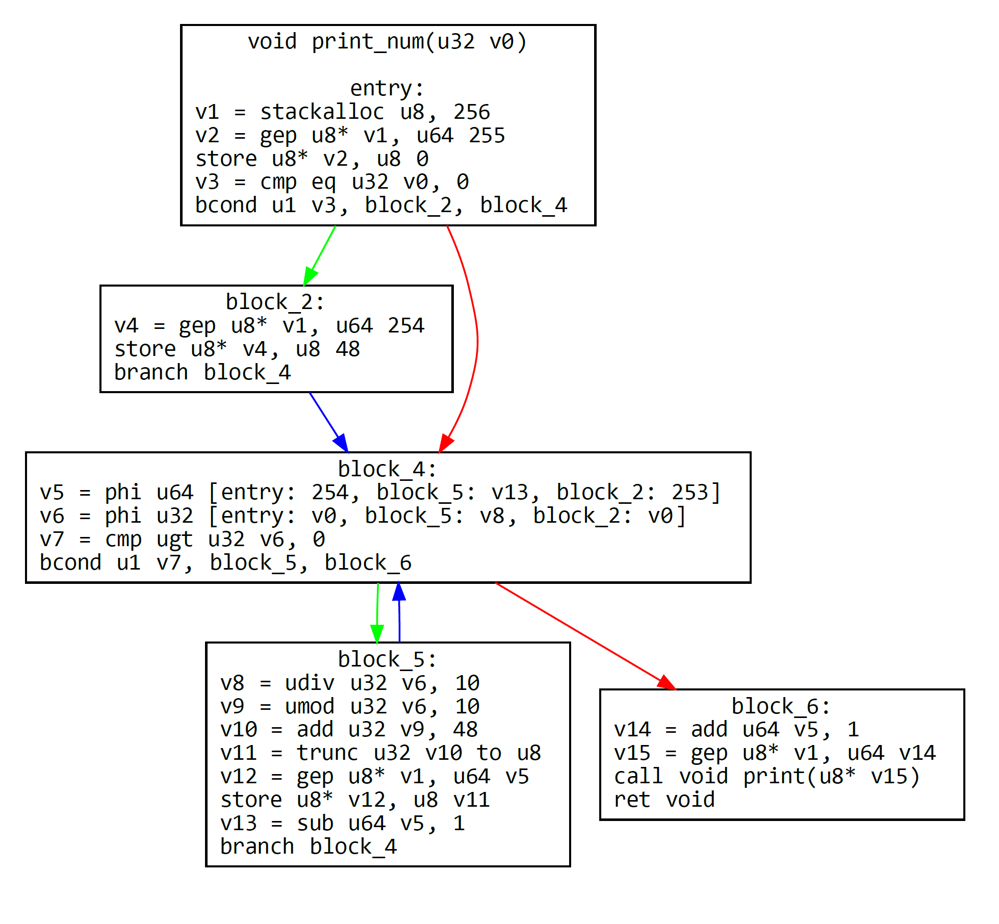

Simple hobby compiler project. Custom language gets converted to intermediate representation and
then machine code is generated. IR is language-independent and as example this project contains 
IR-based brainfuck compiler. A lot of features are missing.

usage: `cargo run [source file]`

1. Source code goes through lexer and parser which generates AST.

```
void print_num(u32 num) {
    u8 buffer[256];
    i64 i = 255;

    buffer[i] = 0;
    i -= 1;

    if (num == 0) {
        buffer[i] = 48u8;
        i -= 1;
    }

    while (num > 0) {
        u8 char = (num % 10u8) + 48u8;
            
        buffer[i] = char;
        i -= 1;

        num /= 10u8;
    }

    print(&buffer[i + 1]);
}
```

2. AST gets converted to language-independent intermediate representation.



3. Optimization passes are ran on generated IR.



4. Values are assigned registers and x64 machine code is generated.

```asm
00  push rbp
02  mov rbp,rsp
05  sub rsp,0x108
0C  push r13
0F  push rsi
11  push rdi
13  push r12
16  push rbx
18  mov [rbp+0x10],rcx
1C  lea r13,[rbp-0x100]
23  mov byte [r13+0xff],0x0
2B  mov r12,0xfe
32  mov ebx,[rbp+0x10]
35  cmp dword [rbp+0x10],byte +0x0
39  jnz near 0x51
3F  mov byte [r13+0xfe],0x30
47  mov r12,0xfd
4E  mov ebx,[rbp+0x10]
51  cmp ebx,byte +0x0
54  jna near 0x7c
5A  mov edi,0xa
60  mov eax,ebx
62  xor edx,edx
64  div edi
66  mov esi,eax
68  mov ebx,edx
6A  add ebx,byte +0x30
6D  mov [r13+r12+0x0],bl
72  dec r12
75  mov ebx,esi
77  jmp 0x51
7C  inc r12
7F  lea r13,[r13+r12+0x0]
84  sub rsp,byte +0x20
88  mov rcx,r13
8B  mov rax,0x7ff78e441a60
95  call rax
97  add rsp,byte +0x20
9B  pop rbx
9D  pop r12
A0  pop rdi
A2  pop rsi
A4  pop r13
A7  mov rsp,rbp
AA  pop rbp
AC  ret
```
